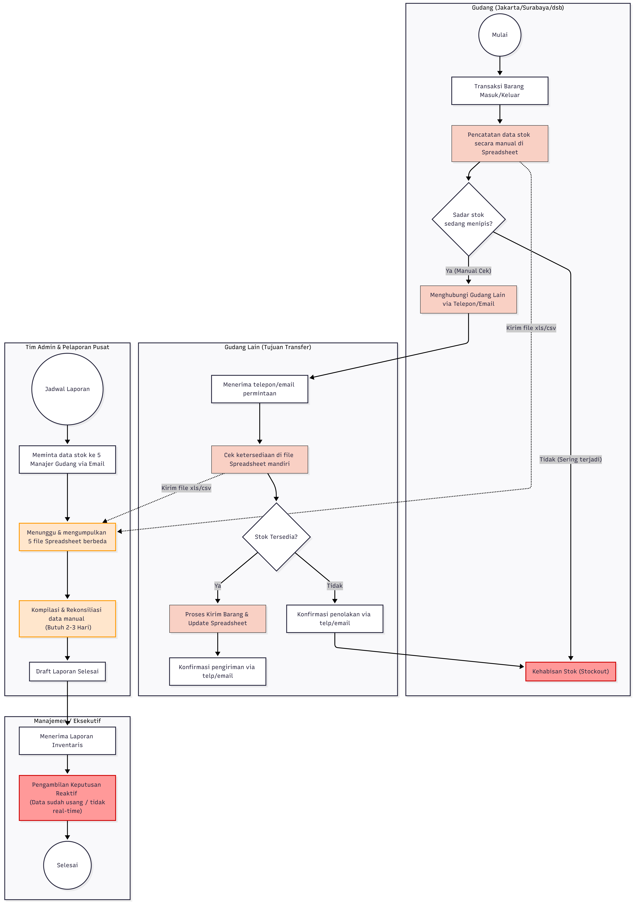

# 1. BRD (Business Requirements Document)

## 1.1 Pendahuluan

PT Maju Bersama Digital merupakan perusahaan distributor skala nasional yang bergerak dalam penyediaan barang elektronik. Operasional logistik perusahaan ditopang oleh 5 gudang utama yang tersebar di kota-kota strategis di Indonesia: Jakarta, Surabaya, Bandung, Medan, dan Makassar. Seiring dengan peningkatan volume transaksi harian dan ekspansi portofolio produk, model pengelolaan inventaris tradisional yang saat ini berjalan memicu munculnya kendala operasional yang masif.

Ketergantungan terhadap pencatatan manual berbasis spreadsheet menyebabkan tingginya angka ketidaksesuaian data (*stock disparity*), hambatan alur birokrasi komunikasi antar-gudang, serta keterlambatan konsolidasi laporan eksekutif yang memakan waktu hingga 3 hari. Guna mempertahankan keunggulan kompetitif dan mengeliminasi hilangnya potensi pendapatan akibat kendala kehabisan stok (*stockout*), manajemen memutuskan untuk menginisiasi pembangunan platform **SmartStock Pro**. Platform berbasis web ini diproyeksikan sebagai solusi terpusat guna merestrukturisasi manajemen rantai pasok secara real-time, akurat, dan aman.

---

## 1.2 Identifikasi Masalah

1. Pencatatan stok masih dilakukan secara manual menggunakan spreadsheet sehingga sering terjadi ketidaksesuaian data.
2. Proses transfer barang antar gudang memakan waktu lama karena koordinasi via telepon dan email.
3. Pelaporan stok membutuhkan waktu 2–3 hari karena harus mengompilasi data dari berbagai sumber.
4. Tidak ada sistem peringatan ketika stok menipis, sehingga sering terjadi kehabisan stok produk yang sedang tinggi permintaannya.
5. Manajemen kesulitan memantau performa inventaris secara real-time untuk pengambilan keputusan.

---

## 1.3 Tujuan & Kriteria Keberhasilan

1. Meningkatkan tingkat akurasi dan konsistensi data inventaris hingga mencapai indeks kesesuaian ≥ 99.8% antara data sistem dan stok fisik gudang.
2. Memangkas durasi proses administrasi dan koordinasi transfer barang antar gudang hingga ≥ 85% melalui sistem transfer inventaris terintegrasi.
3. Mempercepat proses penyusunan dan konsolidasi laporan inventaris dari 2–3 hari menjadi real-time dengan waktu akses kurang dari 10 detik.
4. Menekan tingkat kejadian kehabisan stok produk *fast-moving* hingga ≤ 1% melalui sistem peringatan stok minimum otomatis dan pemantauan persediaan aktif.
5. Meningkatkan kemampuan monitoring dan pengambilan keputusan manajemen melalui dashboard inventaris real-time yang dapat diakses 24/7 di seluruh gudang perusahaan.

---

## 1.4 Profil Pengguna

1. **Administrator Sistem**: Bertanggung jawab mengelola pengguna, hak akses, keamanan sistem, audit log, serta memastikan seluruh fitur SmartStock Pro berjalan dengan baik.

2. **Manajer Gudang**: Bertanggung jawab memantau stok barang, mengelola proses transfer antar gudang, menerima notifikasi stok kritis, serta memonitor performa inventaris pada gudang yang dikelola.

3. **Staf Gudang**: Bertugas melakukan operasional inventaris harian seperti mencatat barang masuk dan keluar, memperbarui data stok, serta memproses transfer barang antar gudang.

4. **Viewer / Manajemen Perusahaan**: Bertugas memantau laporan dan dashboard inventaris secara real-time untuk mendukung pengambilan keputusan tanpa memiliki akses untuk mengubah data.

---

## 1.5 AS-IS Business Process



```
flowchart TD
    %% Styling
    classDef manualProcess fill:#f9d0c4,stroke:#333,stroke-width:1px;
    classDef warning fill:#ff9999,stroke:#c00,stroke-width:2px;
    classDef timeDelay fill:#ffe6cc,stroke:#ff9900,stroke-width:2px;
    
    subgraph Gudang_Asal ["Gudang (Jakarta/Surabaya/dsb)"]
        A((Mulai)) --> B["Transaksi Barang Masuk/Keluar"]
        B --> C["Pencatatan data stok secara manual di Spreadsheet"]:::manualProcess
        C --> D{"Sadar stok <br> sedang menipis?"}
        D -- "Tidak (Sering terjadi)" --> E["Kehabisan Stok (Stockout)"]:::warning
        D -- "Ya (Manual Cek)" --> F["Menghubungi Gudang Lain via Telepon/Email"]:::manualProcess
    end

    subgraph Gudang_Tujuan ["Gudang Lain (Tujuan Transfer)"]
        F --> G["Menerima telepon/email permintaan"]
        G --> H["Cek ketersediaan di file Spreadsheet mandiri"]:::manualProcess
        H --> I{"Stok Tersedia?"}
        I -- "Tidak" --> J["Konfirmasi penolakan via telp/email"]
        J --> E
        I -- "Ya" --> K["Proses Kirim Barang & Update Spreadsheet"]:::manualProcess
        K --> L["Konfirmasi pengiriman via telp/email"]
    end

    subgraph Pelaporan ["Tim Admin & Pelaporan Pusat"]
        M((Jadwal Laporan)) --> N["Meminta data stok ke 5 Manajer Gudang via Email"]
        C -.-> |"Kirim file xls/csv"| O
        H -.-> |"Kirim file xls/csv"| O
        N --> O["Menunggu & mengumpulkan 5 file Spreadsheet berbeda"]:::timeDelay
        O --> P["Kompilasi & Rekonsiliasi data manual <br> (Butuh 2-3 Hari)"]:::timeDelay
        P --> Q["Draft Laporan Selesai"]
    end

    subgraph Manajemen ["Manajemen / Eksekutif"]
        Q --> R["Menerima Laporan Inventaris"]
        R --> S["Pengambilan Keputusan Reaktif <br> (Data sudah usang / tidak real-time)"]:::warning
        S --> T((Selesai))
    end
```