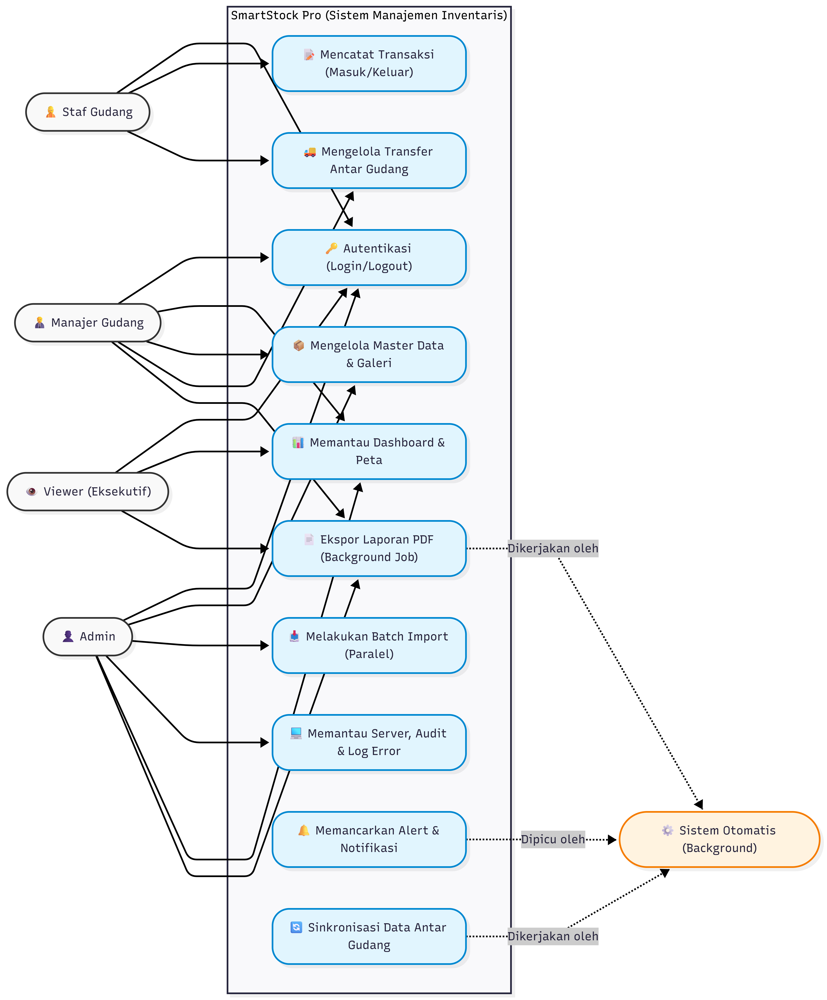
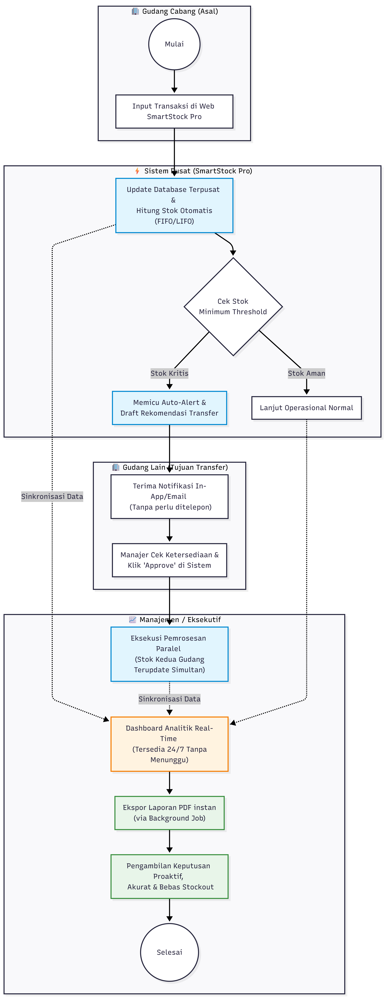

# 2. SRS (Software Requirements Specification)

## 2.1 Deskripsi Umum Aplikasi

SmartStock Pro didesain menggunakan arsitektur monolitik modular atau arsitektur layanan terdistribusi yang mengutamakan throughput tinggi, ketersediaan tinggi (*high availability*), dan toleransi kesalahan (*fault tolerance*). Sistem dibangun menggunakan platform web modern dengan backend tangguh berbasis bahasa pemrograman terkompilasi atau runtime asynchronous berkinerja tinggi, dikombinasikan dengan sistem manajemen basis data relasional (RDBMS) yang mendukung penuh fitur transaksional ACID (*Atomicity, Consistency, Isolation, Durability*).

---

## 2.2 Kebutuhan Fungsional

### Modul 1: Autentikasi dan Keamanan

1. Sistem login dengan autentikasi multi-level (Admin, Manajer Gudang, Staf Gudang, Viewer).
2. Implementasi password hashing (bcrypt/argon2) dan validasi kekuatan password.
3. Proteksi terhadap serangan SQL Injection, XSS, dan CSRF.
4. Sistem session management dengan timeout otomatis.
5. Audit log untuk mencatat seluruh aktivitas pengguna (siapa, kapan, melakukan apa).
6. Dokumen analisis risiko keamanan informasi beserta langkah mitigasi.

### Modul 2: Dashboard dan Real-Time Monitoring

1. Dashboard utama dengan grafik dan chart interaktif menampilkan ringkasan stok, tren barang masuk/keluar, dan nilai inventaris.
2. Real-time notification ketika ada perubahan stok kritis.
3. Galeri produk dengan fitur upload dan preview gambar (multimedia).
4. Peta lokasi gudang interaktif menggunakan integrasi peta (Leaflet/Google Maps).
5. Panel monitoring resource server (CPU usage, memory, response time) yang diperbarui secara otomatis.
6. Export laporan dalam format PDF dengan elemen visual (logo, grafik, tabel berwarna).

### Modul 3: Manajemen Data Inventaris (CRUD + SQL)

1. CRUD lengkap untuk data: Produk, Kategori, Gudang, Supplier, Transaksi Masuk/Keluar.
2. Implementasi query SQL.
3. Algoritma pencarian produk.
4. Algoritma perhitungan stok otomatis (FIFO/LIFO).
5. Pagination, sorting, dan filtering data dengan performa optimal.

### Modul 4: Sistem Notifikasi dan Alert

1. Alert otomatis ketika stok produk di bawah minimum threshold (email dan/atau in-app notification).
2. Notifikasi error/exception pada aplikasi yang dikirim ke admin.
3. Monitoring uptime dan alert jika response time melebihi threshold yang ditentukan.
4. Dashboard log error dengan kategorisasi severity (critical, warning, info).

### Modul 5: Pemrosesan Paralel dan Transfer Antar Gudang

1. Fitur transfer barang antar gudang dengan pemrosesan paralel sehingga stok di gudang asal dan tujuan diperbarui secara bersamaan tanpa bottleneck.
2. Batch import data produk dari file CSV/Excel dengan proses parallel.
3. Background job untuk generate laporan besar tanpa mengganggu respons UI.
4. Implementasi job queue untuk sinkronisasi data otomatis antar gudang.

---

## 2.3 Kebutuhan Non-Fungsional

1. **Performa (Performance)**: Dashboard utama harus dimuat ≤ 1.5 detik dan query stock balance diselesaikan ≤ 200 ms pada kondisi jaringan standar.

2. **Skalabilitas (Scalability)**: Sistem harus mampu menangani hingga 500 koneksi bersamaan dan mendukung pertumbuhan data transaksi hingga 10 juta record tanpa penurunan performa signifikan.

3. **Ketersediaan (Availability)**: Sistem harus memiliki uptime minimal 99.9% di luar jadwal pemeliharaan terencana.

4. **Kompatibilitas (Compatibility)**: Aplikasi harus berjalan optimal pada browser modern utama serta mendukung tampilan responsif di desktop dan perangkat seluler.

---

## 2.4 Diagram Use Case



```
flowchart LR
    %% Definisi Style
    classDef actor fill:#f9f9f9,stroke:#333,stroke-width:2px;
    classDef usecase fill:#e1f5fe,stroke:#0288d1,stroke-width:2px,rx:20px,ry:20px;
    classDef system fill:#fff3e0,stroke:#f57c00,stroke-width:2px;

    %% Aktor Manusia (Kiri)
    Admin(["👤 Admin"]):::actor
    Manajer(["👨‍💼 Manajer Gudang"]):::actor
    Staf(["👷 Staf Gudang"]):::actor
    Viewer(["👁️ Viewer (Eksekutif)"]):::actor

    %% Aktor Sistem (Kanan)
    System(["⚙️ Sistem Otomatis (Background)"]):::system

    %% Batas Sistem (System Boundary)
    subgraph SmartStock_Pro ["SmartStock Pro (Sistem Manajemen Inventaris)"]
        direction TB
        UC1("🔑 Autentikasi (Login/Logout)"):::usecase
        UC2("📊 Memantau Dashboard & Peta"):::usecase
        UC3("📦 Mengelola Master Data & Galeri"):::usecase
        UC4("📝 Mencatat Transaksi (Masuk/Keluar)"):::usecase
        UC5("🚚 Mengelola Transfer Antar Gudang"):::usecase
        UC6("📥 Melakukan Batch Import (Paralel)"):::usecase
        UC7("📄 Ekspor Laporan PDF (Background Job)"):::usecase
        UC8("💻 Memantau Server, Audit & Log Error"):::usecase
        UC9("🔔 Memancarkan Alert & Notifikasi"):::usecase
        UC10("🔄 Sinkronisasi Data Antar Gudang"):::usecase
    end

    %% Relasi Aktor Manusia ke Use Case
    Admin ---> UC1
    Admin ---> UC3
    Admin ---> UC6
    Admin ---> UC8
    Admin ---> UC2
    Admin ---> UC7

    Manajer ---> UC1
    Manajer ---> UC2
    Manajer ---> UC3
    Manajer ---> UC5
    Manajer ---> UC7

    Staf ---> UC1
    Staf ---> UC4
    Staf ---> UC5

    Viewer ---> UC1
    Viewer ---> UC2
    Viewer ---> UC7

    %% Relasi Use Case ke Sistem Otomatis
    UC7 -.->|"Dikerjakan oleh"| System
    UC9 -.->|"Dipicu oleh"| System
    UC10 -.->|"Dikerjakan oleh"| System
```

---

## 2.5 Definisi Aktor

1. **Admin**: Pengelola tertinggi yang memiliki akses penuh ke sistem, termasuk pemantauan server, log error, audit log, manipulasi master data, dan batch import.

2. **Manajer Gudang**: Penanggung jawab operasional di wilayah tertentu. Dapat melihat laporan/dashboard, menyetujui transfer barang, dan mengelola data produk/kategori.

3. **Staf Gudang**: Operator lapangan yang bertugas mencatat transaksi harian (masuk/keluar), dan menginisiasi proses transfer antar gudang.

4. **Viewer**: Pihak manajemen atau eksekutif yang hanya memiliki hak akses *read-only* untuk melihat dashboard, tren, nilai inventaris, peta gudang, dan mengekspor laporan.

5. **Sistem Otomatis (Background Agent)**: Aktor non-manusia berupa job queue/background worker yang bertugas menghasilkan laporan raksasa di latar belakang, memancarkan notifikasi/alert, dan menyinkronkan data antar gudang.

---

## 2.6 Deskripsi Use Case

1. **UC1: Autentikasi (Login/Logout)**: Pengguna masuk ke sistem berdasarkan level (*Role-Based Access*). Session timeout otomatis berlaku, dilindungi dari XSS/CSRF, dan password di-hash menggunakan bcrypt/argon2.

2. **UC2: Memantau Dashboard & Peta**: Melihat ringkasan grafik, tren mutasi stok, nilai valuasi, notifikasi UI real-time, serta memantau peta lokasi 5 gudang interaktif (Leaflet/Maps).

3. **UC3: Mengelola Master Data**: Melakukan CRUD lengkap pada Produk, Kategori, Gudang, Supplier beserta upload gambar ke galeri produk. Memanfaatkan optimasi sorting, filtering, dan pencarian.

4. **UC4: Mencatat Transaksi Barang**: Merekam data barang masuk dan barang keluar. Secara otomatis memicu perhitungan stok sistem FIFO/LIFO dari backend.

5. **UC5: Mengelola Transfer Gudang**: Melakukan pemindahan barang antar gudang (contoh: Jakarta → Surabaya). Sistem memproses transfer secara paralel tanpa bottleneck.

6. **UC6: Melakukan Batch Import**: Mengimpor file CSV/Excel berisi ribuan data ke dalam sistem yang diproses secara paralel menggunakan multi-worker.

7. **UC7: Ekspor Laporan PDF**: Meminta unduhan laporan lengkap ber-elemen visual (logo, grafik). Jika data sangat besar, proses dialihkan ke background job agar UI tetap responsif.

8. **UC8: Memantau Server & Log**: Melihat telemetry server (CPU, RAM, Response Time), audit log seluruh pengguna, serta dashboard error log berdasarkan tingkat keparahan.

9. **UC9: Memancarkan Alert/Notifikasi**: Sistem secara kontinu melakukan monitoring. Jika stok di bawah minimum atau response time tinggi, alert dikirim melalui email/in-app notification kepada Admin dan Manajer Gudang.

10. **UC10: Sinkronisasi Data Gudang**: Tugas otomatis berjalan di background/job queue untuk memastikan data inventaris antar gudang selalu akurat dan tersinkronisasi.

## 2.7 TO-BE Business Process



```
flowchart TD
    %% Styling - Tema Upgrade (Sistem Cepat, Otomatis, dan Sukses)
    classDef sysAuto fill:#e1f5fe,stroke:#0288d1,stroke-width:2px;
    classDef success fill:#e8f5e9,stroke:#388e3c,stroke-width:2px;
    classDef realTime fill:#fff3e0,stroke:#f57c00,stroke-width:2px;

    subgraph Gudang_Asal ["🏢 Gudang Cabang (Asal)"]
        A((Mulai)) --> B["Input Transaksi di Web SmartStock Pro"]
    end

    subgraph SmartStock ["⚡ Sistem Pusat (SmartStock Pro)"]
        B --> C["Update Database Terpusat & <br> Hitung Stok Otomatis (FIFO/LIFO)"]:::sysAuto
        C --> D{"Cek Stok <br> Minimum Threshold"}
        D -- "Stok Aman" --> Z["Lanjut Operasional Normal"]
        D -- "Stok Kritis" --> E["Memicu Auto-Alert & <br> Draft Rekomendasi Transfer"]:::sysAuto
    end

    subgraph Gudang_Tujuan ["🏢 Gudang Lain (Tujuan Transfer)"]
        E --> F["Terima Notifikasi In-App/Email <br> (Tanpa perlu ditelepon)"]
        F --> G["Manajer Cek Ketersediaan & <br> Klik 'Approve' di Sistem"]
    end

    %% Proses sistem berjalan menghubungkan Gudang Tujuan ke Pusat
    G --> H["Eksekusi Pemrosesan Paralel <br> (Stok Kedua Gudang Terupdate Simultan)"]:::sysAuto

    subgraph Manajemen ["📈 Manajemen / Eksekutif"]
        C -.-> |Sinkronisasi Data| I
        H -.-> |Sinkronisasi Data| I
        Z -.-> I
        I["Dashboard Analitik Real-Time <br> (Tersedia 24/7 Tanpa Menunggu)"]:::realTime
        I --> J["Ekspor Laporan PDF instan <br> (via Background Job)"]:::success
        J --> K["Pengambilan Keputusan Proaktif, <br> Akurat & Bebas Stockout"]:::success
        K --> L((Selesai))
    end
```