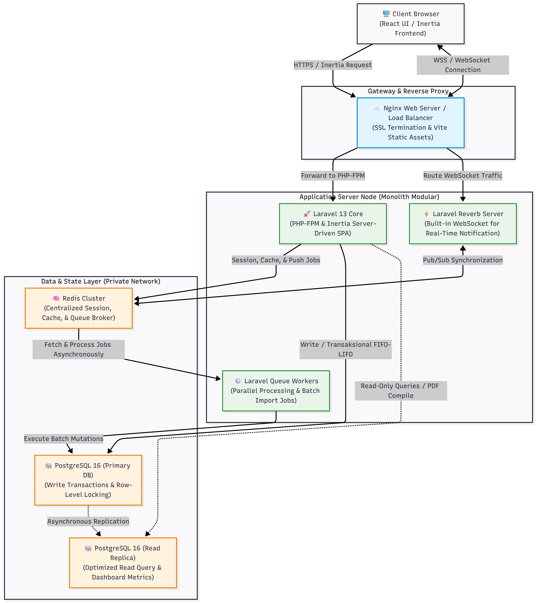

# 3. SDD (Software Design Document)

## 3.1 Arsitektur dan Infrastruktur

### Topologi Server

SmartStock Pro mengadopsi arsitektur monolitik modular berbasis Laravel dan Inertia.js, di mana backend Laravel dan frontend React berjalan dalam satu aplikasi terintegrasi (*server-driven SPA architecture*). Pendekatan ini dipilih untuk menyederhanakan deployment, mempercepat pengembangan fitur, serta tetap memberikan pengalaman antarmuka modern berbasis React tanpa kompleksitas pemisahan frontend-backend secara penuh. Untuk fase pengujian awal (*staging*), sistem dideploy menggunakan infrastruktur PaaS dari Railway sebelum nantinya dimigrasikan ke VPS (*Virtual Private Server*) terkelola seperti DigitalOcean atau Linode pada fase produksi.



```
flowchart TD
    %% Definisi Elemen Desain & Tema Warna
    classDef client fill:#f9f9f9,stroke:#333,stroke-width:2px;
    classDef proxy fill:#e1f5fe,stroke:#0288d1,stroke-width:2px;
    classDef app fill:#e8f5e9,stroke:#388e3c,stroke-width:2px;
    classDef storage fill:#fff3e0,stroke:#f57c00,stroke-width:2px;

    %% Client Layer
    User["🖥️ Client Browser<br>(React UI / Inertia Frontend)"]:::client

    %% Proxy Layer (VPS Production Entry Point)
    subgraph Proxy_Layer ["Gateway & Reverse Proxy"]
        Nginx["☁️ Nginx Web Server / Load Balancer<br>(SSL Termination & Vite Static Assets)"]:::proxy
    end

    %% Monolithic Application Layer (Single Environment Deployment)
    subgraph App_Server_Layer ["Application Server Node (Monolith Modular)"]
        Laravel["🚀 Laravel 13 Core<br>(PHP-FPM & Inertia Server-Driven SPA)"]:::app
        Reverb["⚡ Laravel Reverb Server<br>(Built-in WebSocket for Real-Time Notification)"]:::app
        Workers["⚙️ Laravel Queue Workers<br>(Parallel Processing & Batch Import Jobs)"]:::app
    end

    %% Private Isolated Storage Layer
    subgraph Storage_State_Layer ["Data & State Layer (Private Network)"]
        Redis["🧠 Redis Cluster<br>(Centralized Session, Cache, & Queue Broker)"]:::storage
        PostgresMaster["🐘 PostgreSQL 16 (Primary DB)<br>(Write Transactions & Row-Level Locking)"]:::storage
        PostgresReplica["🐘 PostgreSQL 16 (Read Replica)<br>(Optimized Read Query & Dashboard Metrics)"]:::storage
    end

    %% Alur Komunikasi / Jaringan
    User -->|"HTTPS / Inertia Request"| Nginx
    User <-->|"WSS / WebSocket Connection"| Nginx
    
    Nginx -->|"Forward to PHP-FPM"| Laravel
    Nginx -->|"Route WebSocket Traffic"| Reverb
    
    %% Interaksi Internal Aplikasi dengan State Management (Redis)
    Laravel -->|"Session, Cache, & Push Jobs"| Redis
    Reverb <-->|"Pub/Sub Synchronization"| Redis
    Redis -->|"Fetch & Process Jobs Asynchronously"| Workers
    
    %% Interaksi Aplikasi dengan Database Relasional
    Laravel -->|"Write / Transaksional FIFO-LIFO"| PostgresMaster
    Workers -->|"Execute Batch Mutations"| PostgresMaster
    Laravel -.->|"Read-Only Queries / PDF Compile"| PostgresReplica
    
    %% Sinkronisasi Basis Data
    PostgresMaster -.->|"Asynchronous Replication"| PostgresReplica
```

### Deployment Architecture (Fase Railway ke VPS)

#### 1. Fase Awal (Railway Deployment)

- Sistem dijalankan sebagai beberapa service utama di Railway:
    - **Web Application Service**: Menjalankan Laravel 13, Inertia.js, React, dan Vite dalam satu environment aplikasi.
    - **PostgreSQL Service**: Menyimpan data inventaris terpusat.
    - **Redis Service**: Digunakan untuk queue, cache, session, dan background job.

- Sinkronisasi data, notifikasi, dan job paralel dijalankan menggunakan Laravel Queue Worker berbasis Redis.

#### 2. Fase Lanjutan (VPS Production Migration)

- Nginx digunakan sebagai reverse proxy, load balancer ringan, dan SSL termination.
- Infrastruktur dipisahkan menjadi beberapa node:
    - **Application Server**: Menjalankan Laravel + Inertia.js + React.
    - **Database Server**: Menjalankan PostgreSQL terpisah untuk meningkatkan keamanan dan performa.
    - **Redis & Queue Server**: Menangani caching, queue worker, sinkronisasi data, dan background processing.
- Arsitektur ini memungkinkan skalabilitas horizontal, isolasi beban kerja, dan peningkatan availability pada lingkungan produksi.

---

### Database Architecture

Sistem menggunakan PostgreSQL 16 sebagai RDBMS utama karena memiliki dukungan transaksi ACID yang kuat, performa tinggi, serta fitur Row-Level Locking yang penting untuk mencegah race condition pada proses mutasi stok paralel antar gudang.

1. **Strategi FIFO/LIFO**: Sistem menggunakan tabel `product_batches` untuk mencatat batch barang masuk dan harga pokok persediaan yang terhubung dengan tabel `stock_mutations`. Setiap transaksi barang keluar diproses menggunakan Laravel Database Transaction dan query `SELECT ... FOR UPDATE` untuk mengunci baris data tertentu selama proses pengurangan stok berlangsung sehingga konsistensi data tetap terjaga pada kondisi concurrent transaction.

2. **Optimasi Query dan Replikasi**: Pada lingkungan production, arsitektur database dapat dikembangkan menjadi Primary-Replica untuk memisahkan beban baca dan tulis. Operasi transaksi inventaris diarahkan ke Primary Database, sedangkan proses dashboard dan pelaporan dapat menggunakan Replica Database untuk menjaga performa query tetap optimal.

---

### Network Architecture

1. **Private Network Infrastructure**: Application Server, PostgreSQL, dan Redis ditempatkan pada jaringan privat terisolasi untuk meningkatkan keamanan komunikasi antar service. Hanya port HTTP/HTTPS yang dibuka ke publik melalui Nginx Reverse Proxy.

2. **Reverse Proxy & Routing**: Nginx digunakan sebagai reverse proxy dan SSL termination untuk meneruskan request aplikasi ke Laravel melalui PHP-FPM, sekaligus melayani aset statis hasil build Vite secara efisien.

3. **Real-Time Communication**: Sistem menggunakan WebSocket Broadcasting melalui Laravel Reverb dan Redis Pub/Sub untuk mengirim notifikasi stok kritis, perubahan inventaris, dan event sistem secara real-time ke browser pengguna.

---

### High Availability (HA)

1. **Zero Downtime Deployment**: Deployment dilakukan menggunakan strategi rolling update dan database migration bertahap untuk meminimalkan downtime saat pembaruan sistem.

2. **Database Failover**: Pada lingkungan production, PostgreSQL dapat dikonfigurasi menggunakan mekanisme replication dan automated failover untuk meningkatkan ketersediaan layanan jika terjadi kegagalan pada node utama.

3. **Centralized Session Storage**: Session pengguna disimpan secara terpusat menggunakan Redis sehingga pengguna tetap terhubung meskipun terjadi perpindahan request antar Application Server.

---

## 3.2 Tools dan Framework

1. **Laravel 12 (Backend Framework)**: Digunakan sebagai framework backend utama karena menyediakan fitur authentication, authorization, queue, scheduler, caching, middleware security, dan database transaction management yang cocok untuk kebutuhan inventaris real-time SmartStock Pro.

2. **Inertia.js (Server-Driven SPA Bridge)**: Digunakan sebagai penghubung antara Laravel dan React untuk membangun pengalaman SPA modern tanpa perlu memisahkan backend dan frontend secara penuh.

3. **React (Frontend Library)**: Digunakan untuk membangun antarmuka dashboard yang interaktif, modular, dan responsif, khususnya untuk monitoring stok, grafik inventaris, dan notifikasi real-time.

4. **Vite (Frontend Build Tool)**: Digunakan sebagai bundler dan development server modern untuk mempercepat proses development serta menghasilkan build frontend yang ringan dan optimal.

5. **PostgreSQL 16 (Relational Database Management System)**: Digunakan sebagai database utama karena mendukung transaksi ACID, Row-Level Locking, indexing tingkat lanjut, dan performa query tinggi untuk menjaga konsistensi data inventaris.

6. **Redis (Cache, Queue, dan Pub/Sub)**: Digunakan untuk caching, queue broker, centralized session storage, serta komunikasi real-time berbasis Pub/Sub pada sistem notifikasi dan sinkronisasi data.

7. **Laravel Queue & Scheduler**: Digunakan untuk menjalankan background job seperti batch import CSV/Excel, generate laporan PDF, pengiriman notifikasi otomatis, dan sinkronisasi data antar gudang secara asynchronous.

8. **Laravel Reverb / WebSocket Broadcasting**: Digunakan untuk mendukung komunikasi real-time sehingga perubahan stok, alert, dan pembaruan dashboard dapat langsung diterima pengguna tanpa refresh halaman.

9. **Tailwind CSS (UI Framework)**: Digunakan untuk membangun antarmuka yang responsif, modern, dan konsisten pada berbagai ukuran perangkat dengan pendekatan utility-first CSS.

10. **Railway (Staging Infrastructure)**: Digunakan sebagai platform deployment awal untuk mempermudah pengujian, integrasi database, dan konfigurasi environment aplikasi SmartStock Pro.

11. **Nginx (Reverse Proxy dan Web Server)**: Digunakan sebagai reverse proxy, SSL termination, dan web server berperforma tinggi untuk menangani request aplikasi dan penyajian aset statis.

12. **Docker (Containerization Platform)**: Digunakan untuk menciptakan environment development dan deployment yang konsisten agar aplikasi dapat berjalan stabil di berbagai lingkungan server.

13. **Git (Version Control System)**: Digunakan untuk mengelola versioning source code, kolaborasi tim pengembang, pelacakan perubahan kode, rollback versi aplikasi, serta mendukung proses deployment dan pembaruan fitur SmartStock Pro secara terstruktur dan aman.

---

## 3.3 ERD (Entity Reational Database)

### 1. Domain Autentikasi & Otorisasi (RBAC)
Tabel-tabel ini menangani akses pengguna dan pengaturan hak istimewa (*Role-Based Access Control*).

* **`users`**: Menyimpan data akun pengguna, kredensial login, status aktif/non-aktif, serta rekaman waktu login terakhir.
* **`roles`**: Mendefinisikan peran yang ada dalam sistem (contoh: Super Admin, Manajer Gudang, Staff Operasional).
* **`permissions`**: Mendefinisikan hak akses spesifik atau tindakan yang boleh dilakukan (contoh: `create-product`, `approve-transfer`).
* **`model_has_roles`**: Tabel pivot yang menghubungkan pengguna (user) dengan peran (role) tertentu.
* **`role_has_permissions`**: Tabel pivot yang menghubungkan sebuah peran (role) dengan daftar hak akses (permissions) yang dimilikinya.
* **`sessions`** & **`password_reset_tokens`**: Tabel sistem Laravel untuk mengelola *session* (mencegah multi-login / mengatur *timeout*) dan token reset *password*.

### 2. Domain Master Data
Tabel-tabel ini menyimpan data referensi yang digunakan sebagai landasan untuk transaksi operasional.

* **`warehouses`**: Menyimpan daftar fasilitas gudang beserta informasi alamat, status aktif, dan titik koordinat (Latitude/Longitude) untuk ditampilkan di Peta/Leaflet.
* **`categories`**: Menyimpan data klasifikasi atau pengelompokan untuk produk.
* **`suppliers`**: Menyimpan informasi entitas atau vendor yang memasok barang ke dalam sistem.

### 3. Domain Produk
Tabel-tabel ini mengelola katalog barang yang ada di sistem.

* **`products`**: Menyimpan data inti/katalog barang (SKU, nama, deskripsi) serta batas peringatan stok (`min_stock_level`).
* **`product_images`**: Menyimpan *path* atau URL ke file gambar dari suatu produk untuk ditampilkan pada galeri antarmuka pengguna.

### 4. Domain Transaksi & Mutasi Barang
Tabel-tabel ini merekam semua pergerakan (masuk, keluar, pindah) dari inventaris.

* **`transactions`**: Mencatat *header* dari aktivitas mutasi barang di satu gudang, baik itu barang masuk (`in`), barang keluar (`out`), atau penyesuaian stok (`adjustment`).
* **`transaction_details`**: Menyimpan daftar barang, kuantitas, dan harga modal (jika masuk) untuk setiap transaksi.
* **`transfers`**: Mencatat proses pergerakan barang antar-gudang (misal: Gudang A ke Gudang B), termasuk melacak status perjalanannya (`pending`, `in_transit`, `completed`).
* **`transfer_details`**: Menyimpan rincian item dan jumlah barang yang dipindahkan dalam sebuah *transfer*.

### 5. Domain Inventaris & Stok (Core WMS)
Tabel-tabel ini menangani ketersediaan barang aktual dan perhitungan nilai valuasi.

* **`inventory_batches`**: Jantung dari sistem metode *First In First Out* (FIFO) atau LIFO. Setiap barang masuk akan menjadi satu baris (batch) di sini. Tabel ini melacak harga modal awal dan secara perlahan mengurangi `remaining_qty` setiap kali ada barang keluar.
* **`stock_summaries`**: Berfungsi sebagai *Materialized View* atau tabel agregasi. Tabel ini menjumlahkan total keseluruhan barang per gudang untuk mempercepat tampilan di *Dashboard* tanpa harus menghitung ulang tabel *batch* yang jumlah datanya bisa jutaan baris.

### 6. Domain Antrean (Queue) & Sistem Bawah Layar
Tabel-tabel infrastruktur bawaan Laravel untuk memastikan performa yang tinggi.

* **`jobs`**, **`job_batches`**, **`failed_jobs`**: Digunakan oleh Laravel Queue/Worker. Berfungsi sebagai antrean tugas-tugas berat agar berjalan secara paralel (seperti sinkronisasi antar-gudang, *batch import* CSV, dan *generate* PDF laporan).
* **`cache`**, **`cache_locks`**: Menyimpan *cache* sistem dan mengelola penguncian (*locking*) proses agar tidak terjadi *race condition* atau data ganda saat beberapa *worker* berjalan di waktu bersamaan.

### 7. Domain Log & Notifikasi
Tabel-tabel untuk kebutuhan audit dan pemberian peringatan.

* **`audit_logs`**: Merekam jejak setiap perubahan data (siapa yang mengubah, kapan, perubahan nilai sebelum vs sesudah). Sangat krusial untuk pelacakan jika terjadi selisih stok.
* **`notifications`**: Menyimpan pesan-pesan penting dari sistem untuk dikirim/ditampilkan ke pengguna (*in-app notification*), seperti saat ada produk yang stoknya sudah menyentuh batas minimum.